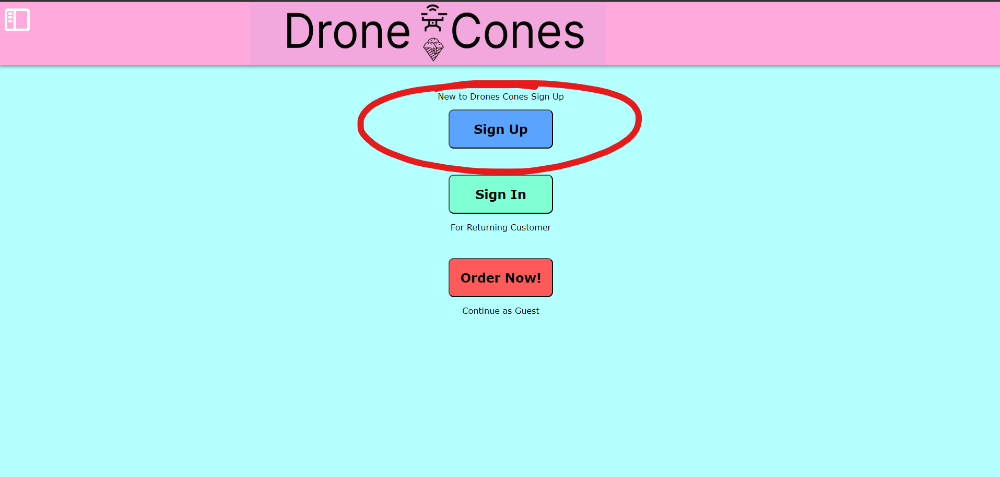
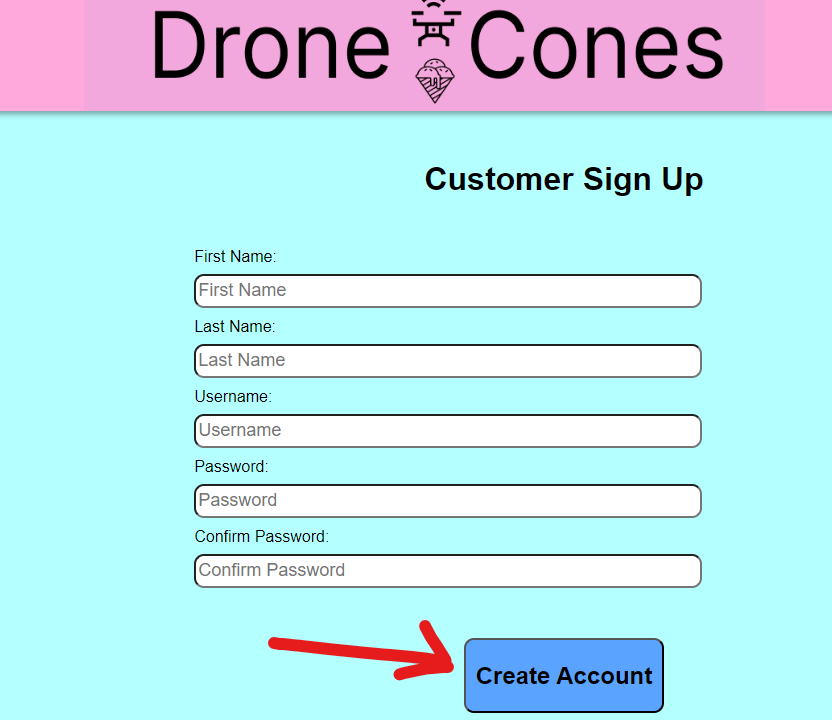
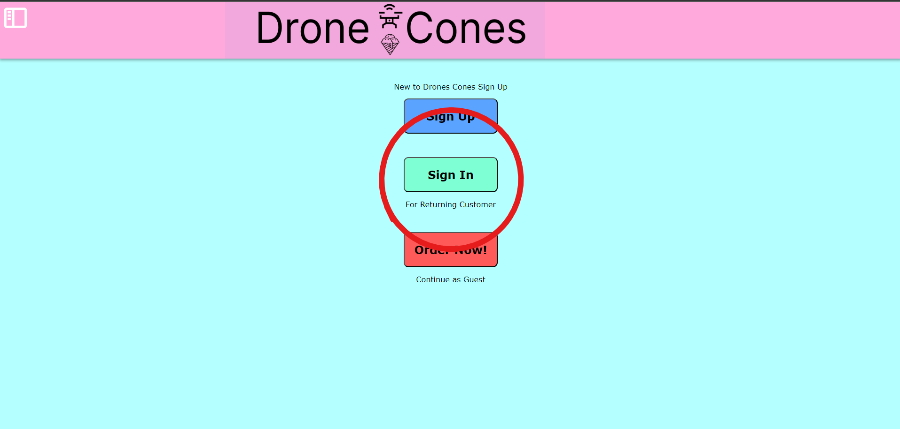
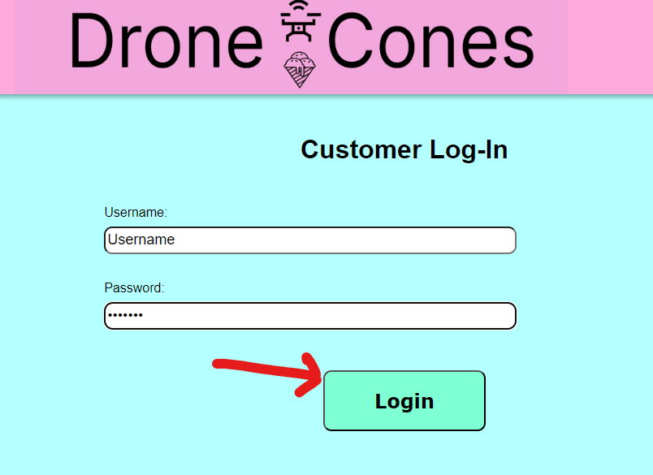

# Customer User Manual

## Introduction

This is the user manual for a customer on the Drone Cones website. If you have any questions, please follow the instructions below. These instructions will guide you through creating a new account, signing in, adding your address to your account, and ordering a drone cone.

## Table of Contents

* [Creating an account](#creating-an-account)
* [Signing in](#signing-in)
* [Adding your address](#adding-your-address)
* [Ordering a cone](#ordering-a-cone)

## Creating an account

When signing up, you will start on the home screen. If you are not at the home screen, you can navigate there by following these steps:

1. Click on the menu in the top left of your screen

2. Click on the "Home" button

When on the home page, to sign up...

1. Click on the "Sign Up" button

2. Fill in your information
3. Click on the "Create Account" button

*Note: if you do not fill in all of your information, you will recieve an error at the botton of your screen*

## Signing in

When signing in, you will start on the home screen. If you are not at the home screen, you can navigate there by following these steps:

1. Click on the menu in the top left of your screen
2. Click on the "Home" button

When on the home page, to sign in...

1. Click on the "Sign In" button

2. Fill in your username and password
3. Click the "Login" button

If you follow the steps correctly, you should be on your account page. This page is where you can add a new address and order a cone.

*Note: if you type in your username or password incorrectly, you will not sign in and a message will display at the bottom of the screen*

## Adding your address

After signing in, you should be on a page that looks like this:

In order to add a new address...

1. Click on the "Add new Address" button
2. Fill in your address into the form that will pop up
3. Click "Add Address" at the bottom of the form

After adding an address, you can delete it by clicking the "Remove" button at the bottom of the address.

## Ordering a cone

To order a cone, you can either be signed in to your account or you can order as a guest.

### Ordering with an account

To order with an account, you must first sign in. When signed in, you should be on a page that looks like this 

1. Click on "Place Order" under "Recent Order"
2. This will navigate you to a screen that looks like this

3. Fill in your cone information then click "Add to Cart" for each cone you are wanting to order
4. Fill in your address
  4.1. You may have to scroll down.
5. Fill in your payment information
6. Review your order to make sure you are ordering what you want, then hit the "Submit Order" button at the bottom of the screen.

After placing an order, you should be brought to a screen that tracks the progress of it being brought to you.

### Ordering as a guest

You can order as a guest if you are not wanting to make an account.

1. When on the home page, click on the "Order Now!" button.
2. This will navigate you to a screen that looks like this

3. Fill in your cone information then click "Add to Cart" for each cone you are wanting to order
4. Fill in your address
5. Fill in your payment information
6. Review your order to make sure you are ordering what you want, then hit the "Submit Order" button at the bottom of the screen.

After placing an order, you should be brought to a screen that tracks the progress of it being brought to you.
