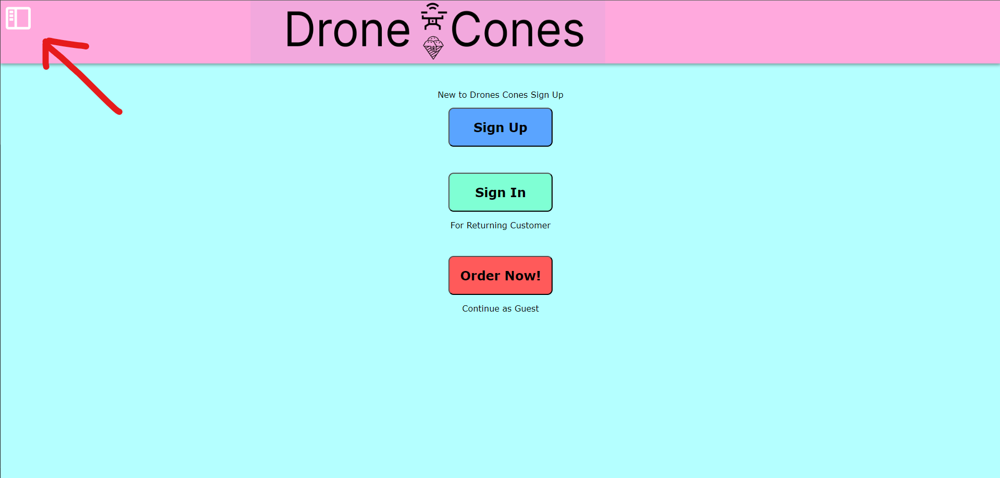

# Drone User Manual

## Introduction

This is the user manual for a Drone User on the Drone Cones website. If you have any questions, please follow the instructions below. These instructions will guide you through creating a new account, signing in, adding drones to your account, and managing drones on your account.

## Table of Contents

* [Creating an account](#creating-an-account)
* [Signing in](#signing-in)
* [Account Page](#account-page)
* [Change Drone Status](#change-drone-status)
* [Add a Drone](#add-a-drone)
* [Edit a Drone](#edit-a-drone)

## Creating an account

When signing up, you will start on the home screen.

1. Click on the menu in the top left of your screen

2. Click on the "Drone Sign Up" button
3. Fill in your information

4. Click on the "Create Account" button

*Note: passwords must be at least 8 charaters long and if you do not fill in all of your information, you will recieve an error at the botton of your screen*

## Signing in

1. Click on the menu in the top left of your screen

2. Click on the "Drone Sign In" button
3. Fill in your username and password
4. Click the "Login" button

If you follow the steps correctly, you should be on your account page. This page will display your name, drones, as well as the total revenue you have made and the amount of deliveries your drones have made. You will also be provided with options to add a drone or edit your current drones.

*Note: if you type in your username or password incorrectly, you will not sign in and a message will display at the bottom of the screen*

## Account Page

As previously noted your account page will contain the info for you and the drones you operate.

Each of your drones will be shown with the corresponding information:

1. drone name
2. revenue made
3. drone status

Drone status will display whether your drone is inactive, active and/or currently delivering. As long as the drone is not currently delivering there is an option the change the status of your drone.

## Change Drone Status

1. While on your account page locate the drone you wish to change the status of.
2. Toggle the switch left to deactivate the drone
3. Toggle the switch right to activate the drone

## Add a Drone

Once you are signed in following the above instructions you will be on your account page showing your drone data.

1. Click on the "Add new Drone" button located below the total deliveries information
2. Fill in the information for your new drone. Including the drone name and size.
    (Size is determined by how many ice cream cones the drone can carry)
3. Click on the "Add Drone" button to save the new drone.
4. If you decide to not add the drone you may click "reset" to discard the new drone changes

## Edit a Drone

Once again you will start from your account page for this.

1. Locate the desired drone and click on the "Edit Drone" button
2. Edit the drone data fields as desired. You can change the name and/or size of the drone.
3. Click on "Submit Edits" to save the changes
4. To discard the changes click on "reset".
