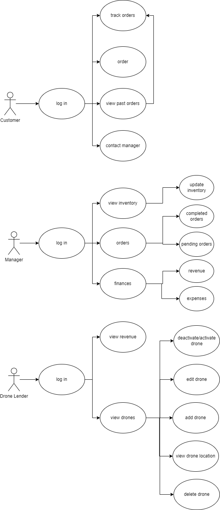

# Drone Cones Requirements

## Introduction

Drone Cones is a cutting edge delivery service that will deliver delicious ice cream to customers using drones that are supplied by drone suppliers.
Anyone will be able to order an Ice Cream cone, and they won't have to leave their house.
Not only will we be helping our hungry customers, we will be giving jobs to the drones that are just laying around peoples homes.

## Table of Contents

- [Functional Requirements](#functional-requirements)
- [Nonfunctional Requirements](#nonfunctional-requirements)
- [Business Requirements](#business-requirements)
- [User Requirements](#user-requirements)

---

## Functional Requirements

The system shall display a home screen with five different options: Sign up(customer), Sign up(drone operator), Log in, Guest Checkout, Contact

### Sign Up (Customer)

- The system shall request the users full name, a username, and a password
- The system shall store the information to the database to create the account when "Submit" button is pressed
- The system shall then direct the user to the log in page

### Sign Up (Drone Owner)

- The system shall request the full name, username, and password of the user
- The system shall store information to the database when "Submit" is pressed
- The system shall then direct the user to the log in page

### Log In

- The System shall request the username and password
- The system shall check the database against the given information
- The system shall display the main page of a logged in user

### Main Page (Drone Lender Logged in)

- The system shall display an option to add a drone
  - The system shall request the name, size, and availability of the drone
  - The system shall request the user to check a box and accept the terms and conditions
- The system shall display current drones and status of if they are currently fulfilling an order or not

### Main Page (Customer Logged in)

- The system shall display the company logo and an option to place an order
  - The system shall allow the customer to choose from at least 3 different ice cream cones
  - The system shall allow the customer to choose from at least 3 different ice cream flavors
  - The system shall allow the customer to choose to add one topping from a list of at least 3 different toppings
  - The system shall allow the customer to add the completed ice cream cone to cart
  - The system shall display the options to add another cone to the order or to checkout

### Checkout

- The system shall display the different cones that have been added to the cart (including prices)
- The system shall request a delivery address
- The system shall display the total cost
- The system shall ask for payment information
- The system shall display a "Complete Purchase" button

### Complete Purchase - Track Order

- The system shall file the order information into the database and begin timer
- The system shall display a timer for when the ice cream will arrive

### Contact Page

- The system shall request information from the user:
  - Name
  - Email/Phone Number
  - Comment/Question
- When "submit" button is pressed the system shall save the form to the database

---

## Nonfunctional Requirements

The system will have a stable server, with decent security. The users should be able to easily use the product on mobile and desktop devices.

### Performance

- Database

  - Quickly obtain stored information

- Server

  - Shall handle light traffic
  - Optimized to run on lower end laptop

- App
  - Load pages quickly

### Security

- Database

  - Shall be password protected
  - Handle user passwords **only** through hashing (one-way encryption)

- Server
  - Not serve confidential information without proper authentication
  - Protect against invalid requests crashing the server

### Usability

- Server

  - Deployable locally so client can test prototype

- App
  - Follow WAI-ARIA specifications (Web Accessibility Initiative)
  - Shall be accessible on both mobile and desktop devices
  - Have a clear User Experience and User Interface

---

## Business Requirements

The application and software will fulfill certain business needs for the client.
These needs include; reports showing valuable financial information, inventory management options, and tools for quality control.
(See [Use Case Diagram](#use-case-diagram))

### Finance

- Reports including:
  - Cost of goods from the supplier
  - Cost of "daily" operations
  - Current income of the company "from the bank"

### Inventory

- Current ice cream products listed (ice cream and ice cream cone)
- Quantity of ice cream products left in stock
  - Options to update current ice cream stock
- Quantity of Drones/Drone Lenders
  - Includes each drones information and "status"
- Quantity of user orders being delivered

### Quality

- Customer Feedback - contact page to get customer feedback on product or concerns
- Company time and distance limit for delivery
- types of drones distance/speed and carrying capacity

## User Requirements

The customers of Drone Cones will be able to have a quick, easy way to buy and receive their drone delivered treat. The drone lenders will be able to give up their drones for some time, and get paid for it. Lastly, the managers should be able to manage the business side of Drone Cones from inside the app.

### Customer

As a customer, I want to be able to:

- Easily order and pick ice cream so that I can get the ice cream I want
- See my past orders, so I can get something I liked from before
- Contact the managers, so that I can complain about things I don't like
- Track my order, so I can see how long I have to wait before enjoying my ice cream

### Drone Lender

As a drone lender, I want to be able to:

- Allow Drone Cones to use my drone to have a small and consistent revenue stream
- Deactivate my drone on Drone Cones so that I can use my drone for personal reasons
- See a list of the drones I have registered with DroneCone and their details so I can know where my drones are and what they are doing

### Manager

As a manager, I want to be able to:

- See inventory, so I can see if I need order more supplies when it get low
- Update inventory, so that the inventory is correct with what I have
- See finances, so I can see how much money I'm making or losing

### Use Case Diagram

